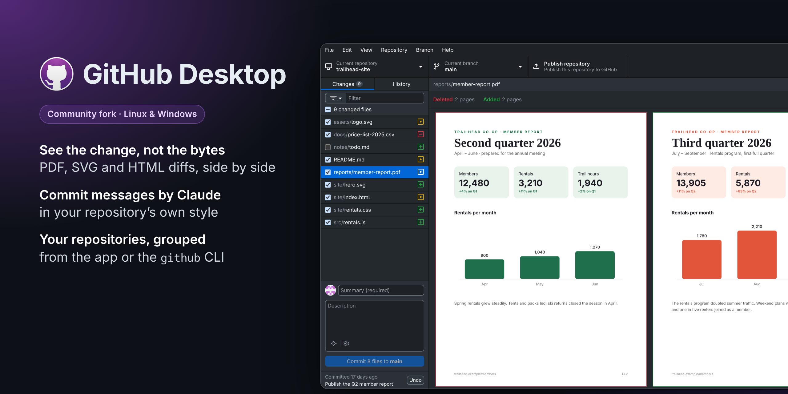
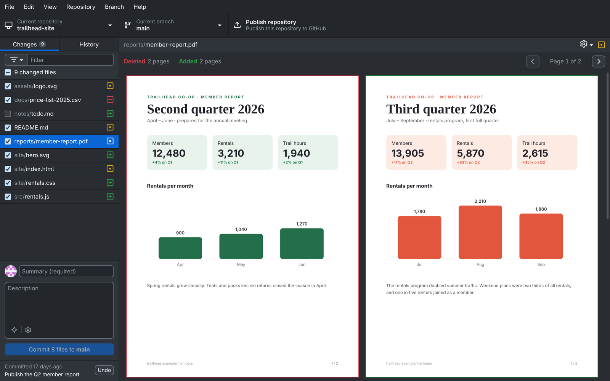
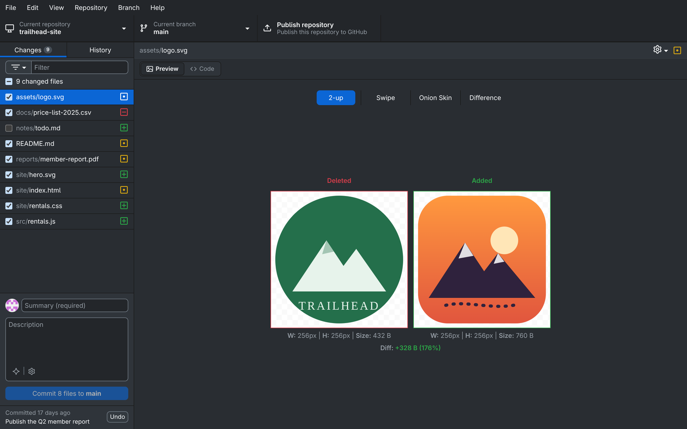
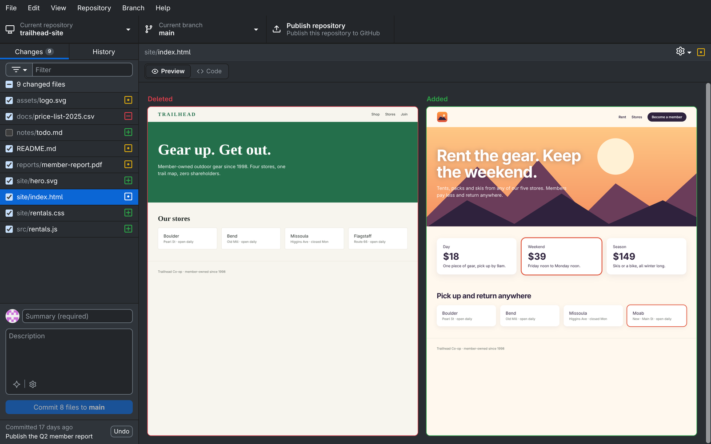
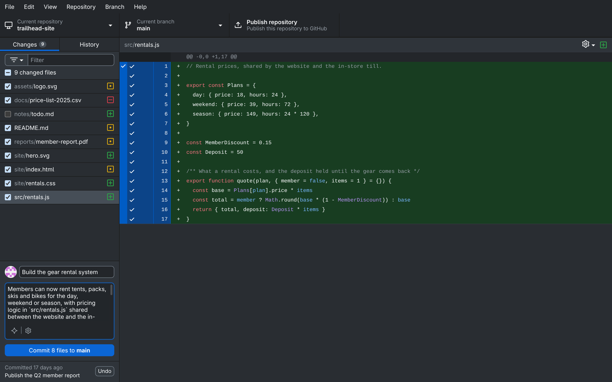
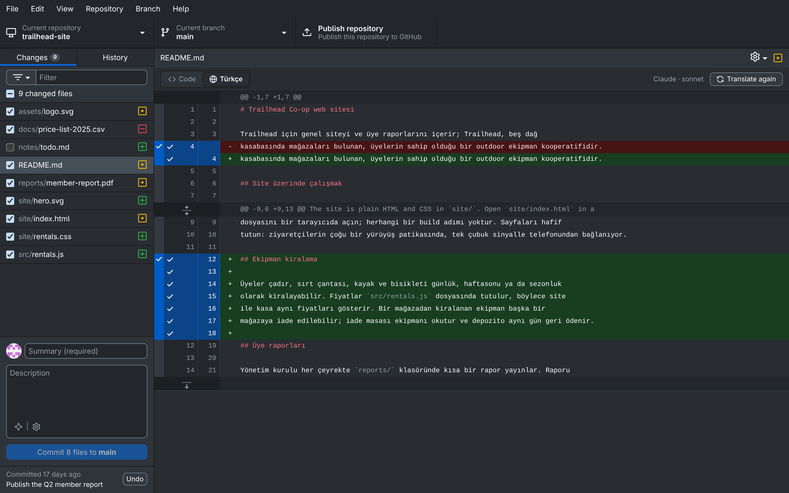
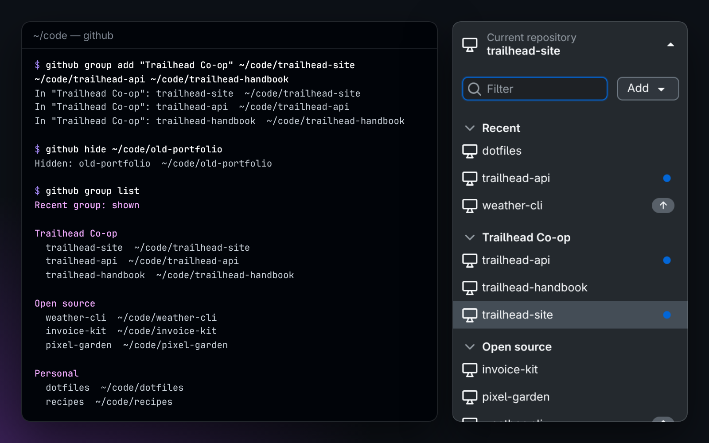
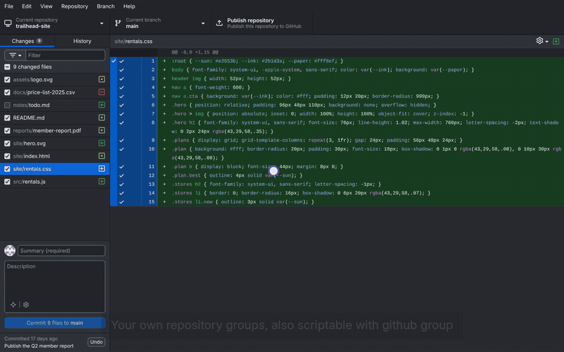

<div align="center">


# GitHub Desktop (fork)

**See what changed in PDFs, SVGs and web pages. Let Claude write the commit message.**<br>
A community fork of GitHub Desktop for Windows and Linux.

[](https://github.com/YakupEmreYerli/desktop/releases/latest)
[](https://github.com/YakupEmreYerli/desktop/releases)

[](https://github.com/YakupEmreYerli/desktop/actions/workflows/fork-ci.yml)
[](../LICENSE)

[**Download for Windows**](https://github.com/YakupEmreYerli/desktop/releases/latest) ·
[**Download for Linux**](#install) ·
[What's new](#features) ·
[Türkçe](README.tr.md)

<br>



</div>

## Why this fork

GitHub Desktop shows a changed PDF, image or web page as "binary file changed"
and leaves the commit message to you. This fork shows the change itself and
can write the message. Everything else is upstream GitHub Desktop, merged
regularly, with your settings, repositories and sign-in shared with the
official app.

Not an official GitHub product. For the official app see
[desktop.github.com](https://desktop.github.com).

## Features

<table>
<tr>
<td width="50%" valign="top">

<h3>PDF diffs</h3>
Old and new pages side by side, with page navigation. Long documents are
drawn page by page as you scroll, in the changes and history views.
</td>
<td width="50%" valign="top">

<h3>SVG diffs</h3>
Shown as images, with swipe, onion skin and difference modes and a
Preview/Code switch.
</td>
</tr>
<tr>
<td width="50%" valign="top">

<h3>HTML previews</h3>
Pages render with their local stylesheets, images and scripts; scripts run
sandboxed. Switch back to the code diff any time.
</td>
<td width="50%" valign="top">

<h3>Commit messages by AI</h3>
One button writes the title and description from your changes, in the
language and style you pick: plain, Conventional Commits, Gitmoji or the
repository's own.
</td>
</tr>
<tr>
<td width="50%" valign="top">

<h3>Documents in Turkish</h3>
Markdown and text files get a Code / Türkçe switch that shows the diff
translated, changed paragraphs highlighted.
</td>
<td width="50%" valign="top">

<h3>Repository groups</h3>
Group, reorder, collapse and hide repositories, from the app or with
<code>github group</code> in a terminal, so scripts and coding agents can
tidy the list too.
</td>
</tr>
</table>

Also: the changes filter has count badges and stays open while you pick
several filters. Full list in [CHANGELOG.md](../CHANGELOG.md).

<details>
<summary><b>Watch the 28-second tour</b></summary>
<br>

<p><a href="assets/demo.mp4">Download as MP4</a></p>
</details>

## Install

Get the file for your system from the
[latest release](https://github.com/YakupEmreYerli/desktop/releases/latest).
Builds are 64-bit (x64).

| System | File | How |
|---|---|---|
| **Windows 10/11** | `GitHubDesktop-…-win-x64.exe` | Run it. Windows warns about an unknown publisher because the build isn't signed: **More info → Run anyway**. |
| **Ubuntu, Debian, Mint** | `…-linux-amd64.deb` | `sudo apt install ./GitHubDesktop-…-linux-amd64.deb` |
| **Fedora, openSUSE** | `…-linux-x86_64.rpm` | `sudo dnf install ./GitHubDesktop-…-linux-x86_64.rpm` |
| **Any Linux, Arch too** | `…-linux-x86_64.AppImage` | `chmod +x` the file and run it. |

Checksums are in `SHA256SUMS.txt` next to the files.

### AI features

AI is off until you choose a provider in **Options → AI**. Each feature
(commit messages, translation) picks its own:

- **Claude**: uses your Claude subscription through the local
  [Claude Code](https://docs.claude.com/en/docs/claude-code/setup) CLI, no API key.
- **DeepSeek** or **OpenRouter**: paste an API key.

## FAQ

<details>
<summary><b>Will my settings and repositories carry over?</b></summary>
<br>
Yes. The fork uses the same settings folder as GitHub Desktop, so your
repositories, preferences and GitHub sign-in are already there.
</details>

<details>
<summary><b>How do I update?</b></summary>
<br>
Install the newer release over the old one. The fork doesn't update itself:
GitHub Desktop's own updater would replace it with the official app, so it's
turned off.
</details>

<details>
<summary><b>Why no macOS build?</b></summary>
<br>
macOS refuses to open unsigned apps, and signing needs a paid Apple developer
account. Upstream's build steps should work on a Mac, but the fork isn't
tested there.
</details>

<details>
<summary><b>How do I go back to the official app?</b></summary>
<br>
Uninstall the fork and install GitHub Desktop from
<a href="https://desktop.github.com">desktop.github.com</a>. Your settings stay.
</details>

## Build from source

<details>
<summary><b>Linux: per-user install, no sudo</b></summary>
<br>

Requirements: git, [nvm](https://github.com/nvm-sh/nvm) (Node version from
`.nvmrc`), Yarn 1 and `libsecret`
([setup-linux.md](../docs/contributing/setup-linux.md)).

```sh
git clone --recurse-submodules https://github.com/YakupEmreYerli/desktop.git
cd desktop
source ~/.nvm/nvm.sh && nvm install && nvm use
yarn
script/linux-kur.sh
```

This installs to `~/.local/opt/github-desktop`, adds a menu entry and the
`github-desktop` and `github` commands (`github --help`). Run it again to
update; close the app first. The `github` command comes only with this
install, not with the release packages.

</details>

<details>
<summary><b>Development commands</b></summary>
<br>

| Command | What it does |
|---|---|
| `yarn build:dev && yarn start` | Development build with a live-reloading renderer |
| `yarn lint` | Prettier and ESLint |
| `yarn test:unit` | Unit tests (`node:test`) |
| `node script/test.mjs <file>` | A single test file |
| `yarn build:prod` | Production build into `dist/` |
| `script/linux-kur.sh [--derleme]` | Build (or reuse `dist/`) and install for this user |
| `script/fork-package.sh` | Package `dist/` into release files (`dist/packages/`) |

Releases: pushing a tag like `v3.6.6-2` builds every package in CI
([fork-release.yml](workflows/fork-release.yml)) and opens a draft release.

Fork additions live in their own files so upstream merges stay clean; the few
places they hook into upstream files are listed in
[ARCHITECTURE.md](../ARCHITECTURE.md#upstream-touch-points).

</details>

| Document | Contents |
|---|---|
| [ARCHITECTURE.md](../ARCHITECTURE.md) | How the fork's features work |
| [DECISIONS.md](../DECISIONS.md) | Why they're built that way |
| [BACKLOG.md](../BACKLOG.md) | What's next |
| [AGENTS.md](../AGENTS.md) | Working rules for contributors and coding agents |
| [CHANGELOG.md](../CHANGELOG.md) | Changes on top of upstream |

## License

[MIT](../LICENSE), same as upstream. GitHub Desktop is © GitHub, Inc.; the
GitHub name and logos aren't covered by the license.
