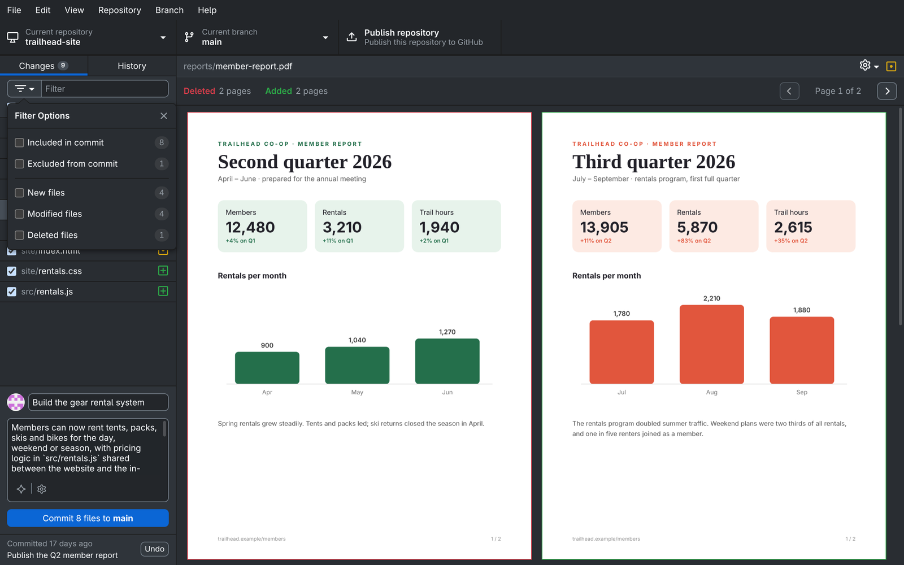

# GitHub Desktop (çatal)

[English](README.md) · **Türkçe**

[](https://github.com/YakupEmreYerli/desktop/actions/workflows/fork-ci.yml)
[](../LICENSE)
[](https://github.com/desktop/desktop)

[GitHub Desktop](https://github.com/desktop/desktop)'un Linux ve Windows'ta günlük
kullanım için tutulan çatalı. Üst deponun üzerine birkaç özellik
ekler ve üst depodaki değişiklikleri almaya devam eder.

Resmî bir GitHub ürünü değildir. Resmî uygulama için
[desktop.github.com](https://desktop.github.com).

<p align="center">
  
</p>

<p align="center">
  <br>
  <a href="assets/demo.mp4">Tanıtım videosu (MP4)</a>
</p>

## Neler farklı

| Özellik | Ayrıntı |
|---|---|
| **Diff'te PDF önizleme** | Eklenen ve silinen PDF'lerin sayfaları görünür; değişen PDF'te eski ve yeni sayfalar yan yana durur, sayfalar arasında gezinilir. Uzun belgeler kaydırdıkça sayfa sayfa çizilir. Değişiklikler ve geçmiş görünümlerinde çalışır. |
| **Diff'te SVG önizleme** | SVG dosyaları resim olarak görünür; eski ve yeni hâl yan yana, kaydırmalı, üst üste ve fark modlarıyla karşılaştırılır, Önizleme/Kod düğmesiyle koda geçilir. |
| **Diff'te HTML önizleme** | HTML dosyaları sayfa olarak açılır; değişen dosyada eski ve yeni hâl yan yana durur, Önizleme/Kod düğmesiyle kod farkına geçilir. Yerel CSS, resim ve script'ler yüklenir; script'ler kafeste çalışır. |
| **Belgelerin Türkçe çevirisi** | Markdown ve metin dosyalarında Kod / Türkçe düğmesi dosyayı Türkçe'ye çevrilmiş gösterir, değişen paragraflar işaretlidir. DeepSeek, OpenRouter ya da Claude aboneliğinle çalışır (Seçenekler → AI). |
| **Derli toplu değişiklik filtresi** | Filtre seçeneklerinde sayı rozetleri ve tam genişlik satırlar var; birden fazla filtre seçerken pencere açık kalır. |
| **Yapay zekâyla commit mesajı** | Commit kutusunun yanındaki düğme değişikliklerinden başlık ve açıklamayı seçtiğin dilde (Türkçe, İngilizce ya da istediğin başka bir dil) ve stilde (sade, Conventional Commits, Gitmoji, deponun kendi stili ya da kendi kuralların) yazar. Her yapay zekâ özelliği Seçenekler → AI'da kendi sağlayıcısını ve modelini seçer (DeepSeek, OpenRouter ya da Claude aboneliğin). |
| **Depo grupları** | Depo listesini kendi gruplarına ayır, grupları sırala ve katla, az açtığın depoları gizle, "Son kullanılanlar" grubunu kapat. Aynısı `github group` komutuyla da yapılır; bir ajan listeyi senin yerine düzenleyebilir. |
| **Komut satırından depo listesi** | `github list`, `github add` ve `github remove` uygulamadaki depoları pencere açmadan listeler, ekler ve çıkarır; betikler ve yapay zekâ ajanları da listeyi yönetebilir. Çıkarmak diskteki klasöre dokunmaz. |
| **Linux ve Windows paketleri** | Her sürümde AppImage, deb, rpm ve Windows kurulumu; ayrıca kaynaktan sudo'suz kullanıcı kurulumu. |

### Ekran görüntüleri


<p align="center"><em>PDF karşılaştırması: eski ve yeni sayfalar yan yana</em></p>


<p align="center"><em>Kaydırma, üst üste ve fark kipleriyle SVG karşılaştırması</em></p>


<p align="center"><em>Stil dosyaları ve görselleriyle açılan HTML karşılaştırması</em></p>


<p align="center"><em>Türkçeye çevrilmiş README, değişen paragraflar işaretli</em></p>


<p align="center"><em>Claude'un yazdığı commit başlığı ve açıklaması</em></p>


<p align="center"><em>github komutuyla düzenlenen depo grupları</em></p>


<p align="center"><em>Sayılı değişiklik filtresi</em></p>

Tam liste (İngilizce): [CHANGELOG.md](../CHANGELOG.md).

## Kurulum

[Son sürümden](https://github.com/YakupEmreYerli/desktop/releases/latest) indirin. Dosyalar x64 ve imzasızdır.

| Sistem | Dosya | Nasıl |
|---|---|---|
| Windows 10/11 | `GitHubDesktop-…-win-x64.exe` | Kurulumu çalıştırın. SmartScreen "bilinmeyen yayıncı" der: **Ek bilgi → Yine de çalıştır**. |
| Ubuntu, Debian, Mint | `…-linux-amd64.deb` | `sudo apt install ./GitHubDesktop-…-linux-amd64.deb` |
| Fedora, openSUSE | `…-linux-x86_64.rpm` | `sudo dnf install ./GitHubDesktop-…-linux-x86_64.rpm` |
| Her Linux (Arch dahil) | `…-linux-x86_64.AppImage` | `chmod +x` verip çalıştırın. |

Ayarlar, depolar ve GitHub girişi resmî uygulamayla ortaktır. Çatal kendini
güncellemez: yeni sürümü üstüne kurun.

### Kaynaktan (Linux)

Gerekenler: git, [nvm](https://github.com/nvm-sh/nvm) (Node sürümü `.nvmrc`
dosyasında), Yarn 1 ve `libsecret`
([setup-linux.md](../docs/contributing/setup-linux.md)).

```sh
git clone --recurse-submodules https://github.com/YakupEmreYerli/desktop.git
cd desktop
source ~/.nvm/nvm.sh && nvm install && nvm use
yarn
script/linux-kur.sh
```

Betik uygulamayı `~/.local/opt/github-desktop` klasörüne kurar, menüye ekler
ve `github-desktop` ile `github` komutlarını oluşturur (`github --help`). Güncellemek için tekrar çalıştırın.
Uygulama açıkken çalışmaz, önce kapatın. Sistemde kurulu bir GitHub Desktop
paketi varsa bu kurulum onun önüne geçer; paketi sonra kaldırabilirsiniz.

## Geliştirme

| Komut | Ne yapar |
|---|---|
| `yarn build:dev && yarn start` | Geliştirme derlemesi, arayüz canlı yenilenir |
| `yarn lint` | Prettier ve ESLint |
| `yarn test:unit` | Birim testler (`node:test`) |
| `node script/test.mjs <dosya>` | Tek test dosyası |
| `yarn build:prod` | Üretim derlemesi (`dist/`) |
| `script/linux-kur.sh [--derleme]` | Derle (ya da `dist/`i kullan) ve bu kullanıcıya kur |
| `script/fork-package.sh` | `dist/`i sürüm dosyalarına paketle (`dist/packages/`) |

## Belgeler

Belgeler İngilizcedir: [ARCHITECTURE.md](../ARCHITECTURE.md) (nasıl çalışıyor),
[DECISIONS.md](../DECISIONS.md) (neden böyle), [BACKLOG.md](../BACKLOG.md)
(sıradaki işler), [AGENTS.md](../AGENTS.md) (katkı ve ajan kuralları).

## Lisans

Üst depoyla aynı: [MIT](../LICENSE). GitHub Desktop © GitHub, Inc.; GitHub adı
ve logoları lisansa dahil değildir.
