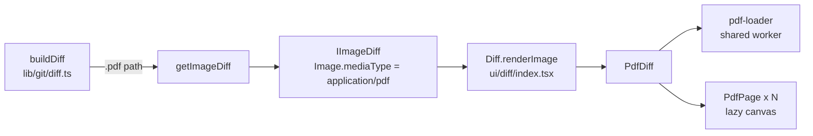

# Architecture of the fork

How the fork's additions work today. The base application is described by
upstream in `docs/technical/` and `docs/process/`. Reasons behind the choices
are in `DECISIONS.md`.

## Upstream touch points

Everything the fork adds lives in its own files. These are the only places
where upstream files are edited; check them first when an upstream merge
conflicts.

| Upstream file | Change |
|---|---|
| `app/src/lib/git/diff.ts` | `buildDiff` sends `.pdf` paths to `getImageDiff`; `getMediaType` returns `application/pdf` |
| `app/src/ui/diff/index.tsx` | `renderImage` renders `PdfDiff` when the image is a PDF |
| `app/src/ui/diff/index.tsx` | `renderText` and the large text case go through `renderWithDocumentView`: `HtmlDiff` for `.html`/`.htm`, `TranslationDiff` for text documents |
| `app/src/models/preferences.ts` | `PreferencesTab.AI` (last, so Copilot's hidden-tab index shift still holds) |
| `app/src/ui/preferences/preferences.tsx` | AI tab: tab label, `getTabId` case, renders `AIPreferences` |
| `app/src/ui/index.tsx` | `registerAISettingsOpener(dispatcher)` |
| `app/webpack.common.ts` | `PdfjsRuntimePlugin` in the renderer config |
| `app/styles/_ui.scss` | imports `ui/pdf-diff`, `ui/html-diff`, `ui/view-switch`, `ui/translation-diff`, `ui/ai-preferences` |
| `app/styles/ui/_changes.scss` | imports `changes/filter-popover` |
| `app/src/ui/changes/changes-list-filter-options.tsx` | options rendered through `renderOption`, popover stays open on toggle |
| `app/package.json`, `app/yarn.lock` | `pdfjs-dist` dependency |
| `app/src/main-process/app-window.ts` | calls `repairWindowStateFile()` before `windowStateKeeper` |

## PDF previews in diffs

**Data.** A PDF reuses the image diff type rather than a new `DiffType`, so no
exhaustive switch in upstream code changes. `lib/pdf.ts` decides what a PDF is
(case-insensitive `.pdf` extension). The check sits in `buildDiff` before the
binary/size checks, so a PDF is previewed even when Git thinks it's text.
`getImageDiff` reads the old and new versions (index, working tree or commits)
into `Image` objects as it does for pictures.

**Rendering** (`app/src/ui/diff/pdf-diffs/`):

- `pdf-diff.tsx`: loads both documents, lays pages out in rows (old left,
  new right for a modified file, one column otherwise), and tracks the page at
  the top of the scroll area for the "Page X of N" navigation. Column width
  follows the pane (`ResizeObserver`), capped at 800 px. A side that has no
  page at that position shows a dashed "No page" box.
- `pdf-page.tsx`: one page. An `IntersectionObserver` (one screen of margin)
  draws the page when it nears the viewport and releases the canvas when it
  leaves, so memory stays flat on long documents. A draw waits for the previous
  draw on the same canvas to finish, and the backing store is capped at
  4096×4096 pixels.
- `pdf-loader.ts`: one pdf.js worker shared by all documents, passed to
  `getDocument` explicitly so closing one document doesn't close the worker.
  The worker is started from a blob URL. Character maps, standard fonts and
  image decoders are read from disk by `DiskBinaryDataFactory` instead of
  `fetch`. Documents are closed via their loading task (`closePdfDocument`).
- Styles: `app/styles/ui/_pdf-diff.scss`. Pages keep a white background in
  both themes; outlines use the deleted/added colours.

**Runtime files.** `app/webpack.pdfjs.ts` emits `pdf.worker.min.mjs`, `cmaps/`,
`standard_fonts/` and `wasm/` from `pdfjs-dist` into `out/pdfjs/`. At runtime
they're resolved as `path.join(__dirname, 'pdfjs')`, which works in the
development build and the packaged app.

**Tests:** `app/test/unit/git/pdf-diff-test.ts` covers new, modified, deleted
and committed PDFs, text-looking PDFs and media types.

## HTML previews in diffs

An HTML file stays a text diff (`DiffType.Text`); only the view changes, so
`lib/git/diff.ts` isn't touched. `Diff.renderText` (and the large text diff path) hands `.html`/`.htm` files
to `HtmlDiff` (`app/src/ui/diff/html-diffs/`) together with the regular text
diff element. A Preview/Code segmented control picks between the rendered pages and that
text diff; the choice is kept in local storage (`html-diff-show-code`), and
Preview is the default.

**Contents.** The old and new source come from the `fileContents` the diff
view already loads for syntax highlighting (`getFileContents`), so they match
the index, working tree or commits being compared.

**Frames.** Each version renders in an `<iframe sandbox="allow-scripts">`
with `srcdoc`. Scripts run in an opaque origin: no Node APIs, no access to the
app window, no popups. Such a frame can't load `file://` URLs, so
`lib/html.ts` (`buildHtmlPreview`) parses the document with `DOMParser` and
inlines what it refers to by relative or root-relative path as data URIs:
stylesheets (as `<style>`, with their `url()` and `@import` references, three
levels deep), scripts, images, `srcset`, media, icons and inline `style`
URLs. Remote URLs load as they are. A `<base target="_blank">` replaces any
existing `<base>`, so clicking a link opens nothing instead of navigating the
frame.

**Scaling and scrolling.** `html-frame.tsx` lays each page out at a 1280 px
wide viewport and scales the frame down to its column with a CSS transform, so
a narrow column (two versions side by side) shows the desktop layout shrunk,
like a PDF page, instead of the page's mobile layout. A script added by
`buildHtmlPreview` posts the page's height to the app (`postMessage`, checked
against the frame's window), and the frame is made that tall, at least as tall
as the visible area. The page area scrolls instead of the frames, so both
versions scroll together and print layouts that turn scrolling off
(`overflow: hidden` on a fixed-size page) are shown in full. A frame grows at
most ten times per document and to 50,000 px, which stops pages sized by the
viewport (`min-height: 100vh` plus padding) from growing forever.

**Limits.** Assets are read from the working tree even when an older version
of the page is shown. `PreviewAssetReader` reads only regular files inside the
repository (after resolving symlinks) and up to 5 MB each, so a page can't
inline, and then send off, files from elsewhere on the machine.

Styles: `app/styles/ui/_html-diff.scss`. Tests:
`app/test/unit/html-preview-test.ts`.

## AI providers

`app/src/lib/ai/providers.ts` is the one place fork features call a model.
Three providers: DeepSeek and OpenRouter over their OpenAI-compatible chat
completions APIs (`fetch`, JSON mode, DeepSeek's thinking turned off), and
Claude through the local `claude` CLI (`--print --output-format json`, no
tools, `--setting-sources ""` so the user's hooks and settings don't run,
no session saved), which uses the user's Claude subscription. The selected
provider and per-provider model live in local storage (`ai-provider`,
`ai-model-<provider>`); API keys are in the OS keychain through `TokenStore`
(`GitHub Desktop - AI provider`, login = provider). `completeWithAI` runs a
prompt on the selected provider and throws `AIProviderError` with a message
meant for the user.

**Settings.** Options → AI (`ui/preferences/ai.tsx`) picks the provider,
the model (free text plus suggestions) and the key, with a connection test.
Changes save immediately, unlike upstream tabs that save on OK. Features
that need a provider call `openAISettings()` (`lib/ai/settings-link.ts`),
which opens that tab through the dispatcher registered at startup.

## Turkish translation of text documents

`.md`, `.markdown`, `.mdx`, `.txt` and `.rst` files get a Code / Türkçe
switch (`ui/diff/view-switch.tsx`, shared with the HTML preview). The view
choice is remembered (`translation-diff-show-translation`); Code is the
default so nothing is sent to a provider until asked.

Documents already in Turkish get no switch: `isMostlyTurkish` weighs
letters only Turkish uses (ğ, ş, ı, İ) and common Turkish words against common
English words in the prose, leaving out code, inline code and URLs.

The Türkçe view is the same diff view as Code, with the text translated line
for line: `TranslationDiff` builds a copy of the diff whose lines carry the
translated text and hands it, with translated file contents for syntax
highlighting and hunk expansion, to `Diff.renderTranslatedTextDiff`, a
`SideBySideDiff` without discard (discarding would write the translation into
the file). Line numbers, colours, split/unified mode and line selection for
committing behave as in the code view.

`lib/ai/translate.ts` splits the old and new versions into blocks at blank
lines, keeping fenced code whole; code isn't translated. The rest go to the
provider as `{"blocks": [...]}` in batches of about 8000 characters, three
requests at a time; the reply must have the same number of blocks, and each
block the same number of lines (`fitToLineCount` joins extra lines onto the
last and pads missing ones). Translations are cached per block (SHA-1 of the
source) in local storage, up to 3000 entries, so unchanged paragraphs shared
by the old and new version are translated once and after an edit only the
changed ones go out again. "Translate again" ignores the cache. Lines whose
block isn't translated yet show the original text. Without a usable provider
the view shows a button to Options → AI, and it starts by itself once one is
set up (`onAISettingsChanged`).

Styles: `_translation-diff.scss`, `_ai-preferences.scss`, `_view-switch.scss`.
Tests: `app/test/unit/ai-translate-test.ts`.

## Changes filter popover

`changes-list-filter-options.tsx` renders each option through `renderOption`:
a full-width checkbox row with the label and a count badge. Rows with a zero
count are dimmed, and a separator divides the commit filters from the file
status filters. Toggling an option keeps the popover open; the counts update
live. Filters combine with AND (`filter-changes-logic.ts`), so a count shows
how many files would remain if that filter were added. Styles in
`app/styles/ui/changes/_filter-popover.scss` override upstream's popover rules
in `_changes-list.scss`.

## Window size on Wayland

Under Wayland, Electron can't read a window's position, so
electron-window-state saves it as 0,0. When the display doesn't start at 0,0
(several monitors), that position counts as off screen and the library resets
the saved state, size included. `app/src/main-process/window-state-position.ts`
rewrites `window-state.json` in the user data directory before the library
reads it: an off-screen position is moved to the display's origin and the size
is clamped to the display. The size survives; the compositor places the window.
Linux only.

## Linux install

`script/linux-kur.sh` runs `yarn build:prod` (skip it with `--derleme`) and
copies `dist/desktop-linux-x64` into `~/.local/opt/github-desktop`. It then
writes the `~/.local/bin/github-desktop` launcher and a
`~/.local/share/applications/github-desktop.desktop` entry. The entry has the
same name as a system package's, so it takes precedence, and it handles the
`x-github-client` and `x-github-desktop-auth` links. The product name stays
"GitHub Desktop", so settings, repositories and sign-in in
`~/.config/GitHub Desktop` carry over from an official install. The script
refuses to run while the installed app is open.

## Continuous integration

`.github/workflows/fork-ci.yml` runs lint, unit tests and a production build
on Ubuntu for pushes to `development` and for pull requests. Upstream's
workflows stay in the tree unchanged but are disabled in the fork's Actions
settings; they target runners and secrets the fork doesn't have.
