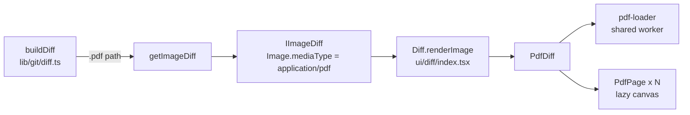

# Architecture of the fork

How the fork's additions work today. The base application is described by
upstream in `docs/technical/` and `docs/process/`. Reasons behind the choices
are in `DECISIONS.md`.

## Upstream touch points

Everything the fork adds lives in its own files. These are the only places
where upstream files are edited; check them first when an upstream merge
conflicts.

| Upstream file | Change |
|---|---|
| `app/src/lib/git/diff.ts` | `buildDiff` sends `.pdf` paths to `getImageDiff`; `getMediaType` returns `application/pdf` |
| `app/src/ui/diff/index.tsx` | `renderImage` renders `PdfDiff` when the image is a PDF |
| `app/webpack.common.ts` | `PdfjsRuntimePlugin` in the renderer config |
| `app/styles/_ui.scss` | imports `ui/pdf-diff` |
| `app/styles/ui/_changes.scss` | imports `changes/filter-popover` |
| `app/src/ui/changes/changes-list-filter-options.tsx` | options rendered through `renderOption`, popover stays open on toggle |
| `app/package.json`, `app/yarn.lock` | `pdfjs-dist` dependency |

## PDF previews in diffs

**Data.** A PDF reuses the image diff type rather than a new `DiffType`, so no
exhaustive switch in upstream code changes. `lib/pdf.ts` decides what a PDF is
(case-insensitive `.pdf` extension). The check sits in `buildDiff` before the
binary/size checks, so a PDF is previewed even when Git thinks it's text.
`getImageDiff` reads the old and new versions (index, working tree or commits)
into `Image` objects as it does for pictures.

**Rendering** (`app/src/ui/diff/pdf-diffs/`):

- `pdf-diff.tsx`: loads both documents, lays pages out in rows (old left,
  new right for a modified file, one column otherwise), and tracks the page at
  the top of the scroll area for the "Page X of N" navigation. Column width
  follows the pane (`ResizeObserver`), capped at 800 px. A side that has no
  page at that position shows a dashed "No page" box.
- `pdf-page.tsx`: one page. An `IntersectionObserver` (one screen of margin)
  draws the page when it nears the viewport and releases the canvas when it
  leaves, so memory stays flat on long documents. A draw waits for the previous
  draw on the same canvas to finish, and the backing store is capped at
  4096×4096 pixels.
- `pdf-loader.ts`: one pdf.js worker shared by all documents, passed to
  `getDocument` explicitly so closing one document doesn't close the worker.
  The worker is started from a blob URL. Character maps, standard fonts and
  image decoders are read from disk by `DiskBinaryDataFactory` instead of
  `fetch`. Documents are closed via their loading task (`closePdfDocument`).
- Styles: `app/styles/ui/_pdf-diff.scss`. Pages keep a white background in
  both themes; outlines use the deleted/added colours.

**Runtime files.** `app/webpack.pdfjs.ts` emits `pdf.worker.min.mjs`, `cmaps/`,
`standard_fonts/` and `wasm/` from `pdfjs-dist` into `out/pdfjs/`. At runtime
they're resolved as `path.join(__dirname, 'pdfjs')`, which works in the
development build and the packaged app.

**Tests:** `app/test/unit/git/pdf-diff-test.ts` covers new, modified, deleted
and committed PDFs, text-looking PDFs and media types.

## Changes filter popover

`changes-list-filter-options.tsx` renders each option through `renderOption`:
a full-width checkbox row with the label and a count badge. Rows with a zero
count are dimmed, and a separator divides the commit filters from the file
status filters. Toggling an option keeps the popover open; the counts update
live. Filters combine with AND (`filter-changes-logic.ts`), so a count shows
how many files would remain if that filter were added. Styles in
`app/styles/ui/changes/_filter-popover.scss` override upstream's popover rules
in `_changes-list.scss`.

## Linux install

`script/linux-kur.sh` runs `yarn build:prod` (skip it with `--derleme`) and
copies `dist/desktop-linux-x64` into `~/.local/opt/github-desktop`. It then
writes the `~/.local/bin/github-desktop` launcher and a
`~/.local/share/applications/github-desktop.desktop` entry. The entry has the
same name as a system package's, so it takes precedence, and it handles the
`x-github-client` and `x-github-desktop-auth` links. The product name stays
"GitHub Desktop", so settings, repositories and sign-in in
`~/.config/GitHub Desktop` carry over from an official install. The script
refuses to run while the installed app is open.

## Continuous integration

`.github/workflows/fork-ci.yml` runs lint, unit tests and a production build
on Ubuntu for pushes to `development` and for pull requests. Upstream's
workflows stay in the tree unchanged; they target runners and secrets the fork
doesn't have.
